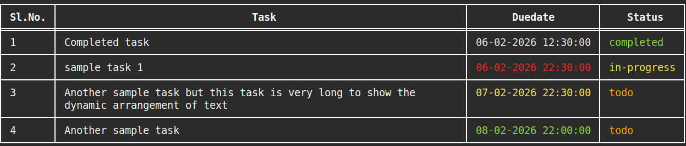

# todols (Todo List) v0.1

## Introduction 
`todols` is a CLI tool designed to help you create and manage your todo list efficiently. It supports adding, updating, and deleting tasks, as well as filtering and sorting them.

The tool provides visual indicators for task due dates using color coding:
- Red indicates that the due date has passed.
- Green indicates that the due date has not yet passed.
- Yellow indicates that less than three hours remain before the due date.

## Requirement 
- Linux Operating System
- Cargo build System [[link](https://doc.rust-lang.org/cargo/getting-started/installation.html)]

## Installation
Clone repository
```bash
git clone https://github.com/Shiv-K-M/todols
```
Go to inside cloned repository and run:
```bash
cargo install --path .
```

## Usage
```bash
todols --help
```
```bash
Simple program to create and manage todo list

Usage: todols [OPTIONS]

Options:
  -a, --add              create a new task
  -u, --update <UPDATE>  update existing task [takes Sl.No and value you want to update: -N, -D or -T]
  -d, --delete <DELETE>  delete a task [takes one or more Sl.No]
  -s, --sort <SORT>      sort the created tasks [possible values: task, duedate, status]
  -r, --reverse          reverse your args [used for: --sort and --filter]
  -f, --filter           filter created tasks [takes: -N, -D or -T]
  -N <NAME>...           name of the task
  -D <DATETIME>...       task due date [format: "%d-%m-%Y %H:%M:%S"]
  -T <TASKSTATUS>...     task status [If not provided default value "todo" is considered] [possible values: todo, in-progress, completed]
  -h, --help             Print help
  -V, --version          Print version
```


## Sample


## Contributing
The contribution rules has not been created yet.

## License
This project is licensed under the MIT License - see the [LICENSE](https://github.com/Shiv-K-M/todols/blob/main/LICENSE) file for details.

